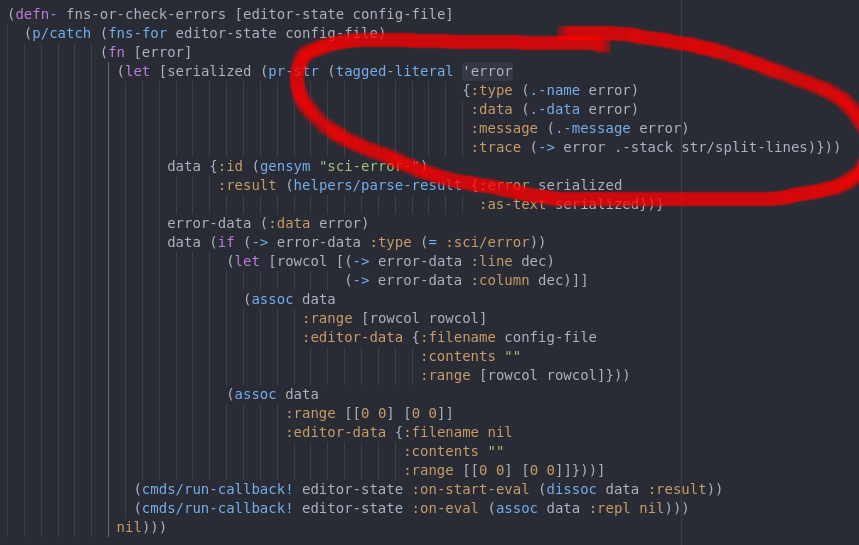

# babel-monster
An amalgamtion of mauricioszabo's [`repl-tooling`](https://github.com/mauricioszabo/repl-tooling) and elenam's [`babel`](https://github.com/Clojure-Intro-Course/babel) projects.

### Important Notes
- The files used from the `babel` project come from the [`nrepl-caught`](https://github.com/Clojure-Intro-Course/babel/tree/nrepl-caught) branch specifically.
- Nothing was done to the stacktrace in any of our error messages as the software that was used in babel,`spectre`, didn't work in ClojureScript and a ClojureScript-friendly version or package with similar functionality wasn't found.  
- When importing the original `repl-tooling` codebase, we needed to use Git LFS (Git Large File System) in order to push the electron app (a small app that allowed us to test Clojure code in a repl).  When pushing, you may or may not be prompted for you git credentials multiple times if you don't have Git LFS cache your credentials.  Apparently, LFS needs to do API things that make it need your credentials more than once.  Also, the third time you are prompted, after you enter your username, it'll ask for your username again.
- To run the electron app:  
    ***If it's your first time running the app, first run `npm install` in the top-level `babel-monster` directory***  
    1. Be in the top-level `babel-monster` directory and run: `./scripts/watch`. This will compile the application
    2.  After the app compiles (in the top-level `babel-monster` directory), in another terminal run: `npm start`.  This will start the app once it's been compiled.

## Documentation for `converting-to-strings` Branch
This section hopes to document all the changes made to the `repl-tooling` and `babel` projects as of 4/27/2023 and will walk through the flow of the data leading to the desired `babel` error messages.

### Changes to the `repl-tooling` Project
In mauricioszabo's repl-tooling, when an exception is thrown in the repl, repl-tooling will mark the result as an `'error` tagged-literal (in `src/repl-tooling/editor_integration/renderer/configs.cljs`):

After being tagged, the result from the repl (a hashmap of the form :  
`{:via [{:type Symbol :message String :at String}] :trace Vector :cause String}`) is sent to `src/repl_tooling/editor-helpers.cljs`, which contains functions that parse the result so that it can be rendered out to the IDE ([lots of examples](https://docs.google.com/document/d/1kGttUJ78a1zI1wHn8tBW131tlv7BMc_VhuXK2UfdDgs/edit?usp=sharing)).  The main function in `editor-helpers` is `read-result` which takes the result from the repl and, depending on what the result was tagged as, does something to it.  This is where the main change to the `repl-tooling` project is.  Instead of using `repl-tooling`'s error parsing function, we told `read-result` to use `babel`'s `modify-message` function which had to be changed a bit to work with Strings.

#### Modifications to `modify-message`
The first change that had to be made was changing all instances where `modify-message` expected a Java object to expect a String, since what the tagged-literal `'error` wasn't the actual Java object, but a hashmap containing the `:type`, `:data`, `:message`, and `:trace` keys.  We then pass the values of the `type` and  `message` as Strings to `str-process-message` in `processor.cljs`. We also decided to not look at spec error messages as we didn't know how we'd integrate babel's spec error messages into this project.  So instead of trying to parse these errors, we return Strings which say what kind of error message the result is for every case except for the case when it's a non-spec or macro error.  
**TODO: Show picture comparing original and changes made**

### Changes to the 'babel' Project
Several original `babel` files were brought into the `repl-tooling` project and
converted to `.cljs` files:  

*`middleware.cljs`*:
Imported to have a the original `modify-message` function in the project.  Nothing was changed in this file.

*`processor.cljs`*:
After the error is passed to `modify-message` the `type` and `message` values (both Strings) get sent to `str-process-message` (which is identical to the original `process-message` function but was used for the sake of clarity and testing).  This function doesn't do anything to its inputs, immediately sending them to `str-process-errors` in `prettify_exception.cljs`. This file contains a lot of other functionality which does spec and macro exception handling.

*`prettify_exception.cljs`*:
All of the original babel functions are still used, and even the original `process-errors` function could still be used, but a new function was created for clarity and to document the changes made. The main function here, `str-process-errors` takes a type of error (as a String, t, i.e. java.lang ArithmeticException) and a message for that error (as a String, m, i.e. Divide by zero).  The `get-match`, `msg-from-matched-entry`, and `first-match` are unchanged from babel, with the exception of `first-match` referencing the error-dictionary through `err-dict/error-dictionary`.  
**TODO: Include screenshot of let and walk through what the first two entries do.**

*`dictionaries.cljs`*:  
The only function used from `dictionaries.cljs` is the `beginandend` function which the error-dictionary uses to add a (?s) at the beginning of a string and (.*) at the end of a string and turns it into a regex for the `first-match` and `msg-from-matched-entry` functions in `prettify-expression.cljs` to match exceptions on.  `beginandend` was not changed from the the original babel implementation.

*`error_dictionary.cljs`*:
Contains a dictionary of exceptions in a vector with each entry being a hashmap having `:key`, `:class`, `:match`, and `:fn` keys.  Also had to import `dictionaries.cljs` in order to use the `beginandend` function.  

## Testing and Current Issues
To see if we get the expected error message, we are using tests from the babel project which include [non-spec](https://github.com/Clojure-Intro-Course/babel/blob/nrepl-caught/test/babel/non_spec_test.clj), [spec-macro](https://github.com/Clojure-Intro-Course/babel/blob/nrepl-caught/test/babel/spec_macro_test.clj), [non-spec-macro](https://github.com/Clojure-Intro-Course/babel/blob/nrepl-caught/test/babel/non_spec_macro_test.clj), and [print-eval](https://github.com/Clojure-Intro-Course/babel/blob/nrepl-caught/test/babel/test_print_eval.clj) tests.  Most of the time, we get the error messages that we expect.  However, there are a few cases in which we do not.  Test results can be found [here](https://docs.google.com/document/d/128G9bLfj3Tt8eIkWO3bYJivUnr812EnJKR1Gx5dEv8g/edit?usp=sharing).
# converting-to-strings-babel-monster

